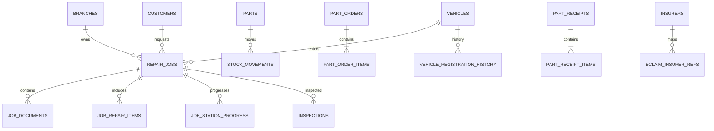

# Rizenic ERP — ER Diagram และ Data Dictionary

เอกสารนี้อธิบายทุกตารางใน schema `rizenic_new` หลัง migration V001–V018 โดยระบุ field, PostgreSQL type, key และหน้าที่ของข้อมูล

## สัญลักษณ์

| Key | ความหมาย |
|---|---|
| PK | Primary key |
| FK → `table.column` | Foreign key |
| PK, FK | เป็นทั้ง primary และ foreign key |

## Relationship overview

## Data dictionary

### องค์กรและสาขา

#### `branches`

| Field | PostgreSQL type | Key | Description |
|---|---|---|---|
| `id` | `bigint` | PK | รหัสรายการแบบ identity |
| `code` | `text` | — | รหัสอ้างอิง |
| `name` | `text` | — | ชื่อรายการ |
| `timezone` | `text` | — | ข้อมูล timezone ของ branches |
| `is_active` | `boolean` | — | เปิดใช้งาน mapping |
| `created_at` | `timestamptz` | — | วันเวลาสร้างข้อมูล |
| `updated_at` | `timestamptz` | — | วันเวลาแก้ไขล่าสุด |

**คำอธิบายตาราง:** ข้อมูลสาขา/ศูนย์บริการที่เป็นเจ้าของใบงาน สต็อก และสิทธิ์การเข้าถึง

**ตัวอย่างข้อมูล (ค่าตัวอย่างเพื่ออธิบายรูปแบบ ไม่ใช่ข้อมูลจริง):**

| Field | Example value |
|---|---|
| `id` | 1 |
| `code` | `EXAMPLE` |
| `name` | `ตัวอย่าง` |
| `timezone` | `ตัวอย่างข้อมูล` |
| `is_active` | true |

#### `departments`

| Field | PostgreSQL type | Key | Description |
|---|---|---|---|
| `id` | `bigint` | PK | รหัสรายการแบบ identity |
| `code` | `text` | — | รหัสอ้างอิง |
| `name` | `text` | — | ชื่อรายการ |
| `is_active` | `boolean` | — | เปิดใช้งาน mapping |

**คำอธิบายตาราง:** ข้อมูลแผนกหรือสายงานที่ใช้กำหนดเส้นทางและผู้รับผิดชอบงาน

**ตัวอย่างข้อมูล (ค่าตัวอย่างเพื่ออธิบายรูปแบบ ไม่ใช่ข้อมูลจริง):**

| Field | Example value |
|---|---|
| `id` | 1 |
| `code` | `EXAMPLE` |
| `name` | `ตัวอย่าง` |
| `is_active` | true |

### องค์กรและสิทธิ์

#### `employees`

| Field | PostgreSQL type | Key | Description |
|---|---|---|---|
| `id` | `bigint` | PK | รหัสรายการแบบ identity |
| `employee_code` | `text` | — | รหัสพนักงาน |
| `display_name` | `text` | — | ชื่อแสดงผล |
| `phone` | `text` | — | เบอร์โทรศัพท์ |
| `home_branch_id` | `bigint` | FK -> branches.id | สาขาหลักของพนักงาน |
| `is_active` | `boolean` | — | เปิดใช้งาน mapping |
| `created_at` | `timestamptz` | — | วันเวลาสร้างข้อมูล |
| `updated_at` | `timestamptz` | — | วันเวลาแก้ไขล่าสุด |

**คำอธิบายตาราง:** ข้อมูลพนักงานและผู้ปฏิบัติงานในระบบ

**ตัวอย่างข้อมูล (ค่าตัวอย่างเพื่ออธิบายรูปแบบ ไม่ใช่ข้อมูลจริง):**

| Field | Example value |
|---|---|
| `id` | 1 |
| `employee_code` | `EXAMPLE` |
| `display_name` | `ตัวอย่าง` |
| `phone` | `0812345678` |
| `home_branch_id` | 1 |

#### `user_accounts`

| Field | PostgreSQL type | Key | Description |
|---|---|---|---|
| `id` | `bigint` | PK | รหัสรายการแบบ identity |
| `employee_id` | `bigint` | FK -> employees.id | พนักงานเจ้าของบัญชี |
| `username` | `text` | — | ชื่อผู้ใช้ระบบ |
| `password_hash` | `text` | — | รหัสผ่านที่ hash แล้ว |
| `credential_state` | `text` | — | สถานะ credential |
| `created_at` | `timestamptz` | — | วันเวลาสร้างข้อมูล |
| `updated_at` | `timestamptz` | — | วันเวลาแก้ไขล่าสุด |

**คำอธิบายตาราง:** บัญชีสำหรับเข้าสู่ระบบที่ผูกกับพนักงาน โดยเก็บรหัสผ่านในรูป hash เท่านั้น

**ตัวอย่างข้อมูล (ค่าตัวอย่างเพื่ออธิบายรูปแบบ ไม่ใช่ข้อมูลจริง):**

| Field | Example value |
|---|---|
| `id` | 1 |
| `username` | `ตัวอย่างข้อมูล` |
| `employee_id` | 1 |
| `password_hash` | `ตัวอย่างข้อมูล` |
| `credential_state` | `EXAMPLE` |

#### `roles`

| Field | PostgreSQL type | Key | Description |
|---|---|---|---|
| `id` | `bigint` | PK | รหัสรายการแบบ identity |
| `code` | `text` | — | รหัสอ้างอิง |
| `name` | `text` | — | ชื่อรายการ |

**คำอธิบายตาราง:** บทบาทของผู้ใช้งาน เช่น ผู้ดูแลระบบ เจ้าหน้าที่รับรถ หรือคลังอะไหล่

**ตัวอย่างข้อมูล (ค่าตัวอย่างเพื่ออธิบายรูปแบบ ไม่ใช่ข้อมูลจริง):**

| Field | Example value |
|---|---|
| `id` | 1 |
| `code` | `EXAMPLE` |
| `name` | `ตัวอย่าง` |

#### `permissions`

| Field | PostgreSQL type | Key | Description |
|---|---|---|---|
| `id` | `bigint` | PK | รหัสรายการแบบ identity |
| `code` | `text` | — | รหัสอ้างอิง |
| `description` | `text` | — | รายละเอียด |

**คำอธิบายตาราง:** รายการสิทธิ์ย่อยที่ใช้ควบคุมการอ่านและแก้ไขข้อมูล

**ตัวอย่างข้อมูล (ค่าตัวอย่างเพื่ออธิบายรูปแบบ ไม่ใช่ข้อมูลจริง):**

| Field | Example value |
|---|---|
| `id` | 1 |
| `code` | `EXAMPLE` |
| `description` | `ตัวอย่างข้อมูล` |

#### `role_permissions`

| Field | PostgreSQL type | Key | Description |
|---|---|---|---|
| `role_id` | `bigint` | PK, FK -> roles.id | บทบาท |
| `permission_id` | `bigint` | PK, FK -> permissions.id | สิทธิ์ |

**คำอธิบายตาราง:** ตารางเชื่อมบทบาทกับสิทธิ์แบบ many-to-many

**ตัวอย่างข้อมูล (ค่าตัวอย่างเพื่ออธิบายรูปแบบ ไม่ใช่ข้อมูลจริง):**

| Field | Example value |
|---|---|
| `role_id` | 1 |
| `permission_id` | 1 |

#### `user_branch_roles`

| Field | PostgreSQL type | Key | Description |
|---|---|---|---|
| `user_id` | `bigint` | PK, FK -> user_accounts.id | บัญชีผู้ใช้ |
| `branch_id` | `bigint` | PK, FK -> branches.id | สาขาที่เป็นเจ้าของข้อมูล |
| `role_id` | `bigint` | PK, FK -> roles.id | บทบาท |

**คำอธิบายตาราง:** ตารางกำหนดว่าบัญชีใดมีบทบาทใดในแต่ละสาขา

**ตัวอย่างข้อมูล (ค่าตัวอย่างเพื่ออธิบายรูปแบบ ไม่ใช่ข้อมูลจริง):**

| Field | Example value |
|---|---|
| `user_id` | 1 |
| `branch_id` | 1 |
| `role_id` | 1 |

#### `user_branch_permissions`

| Field | PostgreSQL type | Key | Description |
|---|---|---|---|
| `user_id` | `bigint` | PK, FK -> user_accounts.id | บัญชีผู้ใช้ |
| `branch_id` | `bigint` | PK, FK -> branches.id | สาขาที่เป็นเจ้าของข้อมูล |
| `permission_id` | `bigint` | PK, FK -> permissions.id | สิทธิ์ |
| `effect` | `text` | — | ข้อมูล effect ของ user_branch_permissions |

**คำอธิบายตาราง:** ตารางกำหนดสิทธิ์เฉพาะบัญชีและสาขา พร้อมผลการอนุญาตหรือปฏิเสธ

**ตัวอย่างข้อมูล (ค่าตัวอย่างเพื่ออธิบายรูปแบบ ไม่ใช่ข้อมูลจริง):**

| Field | Example value |
|---|---|
| `user_id` | 1 |
| `branch_id` | 1 |
| `permission_id` | 1 |
| `effect` | `EXAMPLE` |

### ลูกค้าและรถ

#### `customer_types`

| Field | PostgreSQL type | Key | Description |
|---|---|---|---|
| `id` | `bigint` | PK | รหัสรายการแบบ identity |
| `code` | `text` | — | รหัสอ้างอิง |
| `name` | `text` | — | ชื่อรายการ |
| `is_active` | `boolean` | — | เปิดใช้งาน mapping |

**คำอธิบายตาราง:** ประเภทลูกค้าที่เลือกใช้ในใบงาน

**ตัวอย่างข้อมูล (ค่าตัวอย่างเพื่ออธิบายรูปแบบ ไม่ใช่ข้อมูลจริง):**

| Field | Example value |
|---|---|
| `id` | 1 |
| `code` | `EXAMPLE` |
| `name` | `ตัวอย่าง` |
| `is_active` | true |

#### `customers`

| Field | PostgreSQL type | Key | Description |
|---|---|---|---|
| `id` | `bigint` | PK | รหัสรายการแบบ identity |
| `display_name` | `text` | — | ชื่อแสดงผล |
| `customer_type_id` | `bigint` | FK -> customer_types.id | ประเภทลูกค้า |
| `is_active` | `boolean` | — | เปิดใช้งาน mapping |
| `created_at` | `timestamptz` | — | วันเวลาสร้างข้อมูล |
| `updated_at` | `timestamptz` | — | วันเวลาแก้ไขล่าสุด |

**คำอธิบายตาราง:** ข้อมูลหลักของลูกค้า/ผู้เอาประกัน

**ตัวอย่างข้อมูล (ค่าตัวอย่างเพื่ออธิบายรูปแบบ ไม่ใช่ข้อมูลจริง):**

| Field | Example value |
|---|---|
| `id` | 1 |
| `display_name` | `ตัวอย่าง` |
| `customer_type_id` | 1 |
| `is_active` | true |
| `created_at` | 2026-01-15 |

#### `customer_identity_keys`

| Field | PostgreSQL type | Key | Description |
|---|---|---|---|
| `id` | `bigint` | PK | รหัสรายการแบบ identity |
| `customer_id` | `bigint` | FK -> customers.id | ลูกค้าที่เกี่ยวข้อง |
| `key_type` | `text` | — | ชนิด identity |
| `normalized_key` | `text` | — | ค่า identity ที่ normalize แล้ว |

**คำอธิบายตาราง:** คีย์สำหรับค้นหาและรวมลูกค้าจากข้อมูลเดิม เช่น เลขบัตรหรือเบอร์โทรที่ normalize แล้ว

**ตัวอย่างข้อมูล (ค่าตัวอย่างเพื่ออธิบายรูปแบบ ไม่ใช่ข้อมูลจริง):**

| Field | Example value |
|---|---|
| `id` | 1 |
| `customer_id` | 1 |
| `key_type` | `EXAMPLE` |
| `normalized_key` | `ตัวอย่างข้อมูล` |

#### `customer_contacts`

| Field | PostgreSQL type | Key | Description |
|---|---|---|---|
| `id` | `bigint` | PK | รหัสรายการแบบ identity |
| `customer_id` | `bigint` | FK -> customers.id | ลูกค้าที่เกี่ยวข้อง |
| `contact_type` | `text` | — | ชนิดช่องทางติดต่อ |
| `raw_value` | `text` | — | ค่าช่องทางติดต่อจริง |
| `label` | `text` | — | ป้ายกำกับ |
| `is_primary` | `boolean` | — | เป็นค่าหลัก |
| `is_verified` | `boolean` | — | ผ่านการยืนยัน |
| `created_at` | `timestamptz` | — | วันเวลาสร้างข้อมูล |

**คำอธิบายตาราง:** ช่องทางติดต่อของลูกค้า เช่น โทรศัพท์ มือถือ Line และอีเมล

**ตัวอย่างข้อมูล (ค่าตัวอย่างเพื่ออธิบายรูปแบบ ไม่ใช่ข้อมูลจริง):**

| Field | Example value |
|---|---|
| `id` | 1 |
| `customer_id` | 1 |
| `contact_type` | `EXAMPLE` |
| `raw_value` | `ตัวอย่างข้อมูล` |
| `label` | `ตัวอย่าง` |

#### `car_brands`

| Field | PostgreSQL type | Key | Description |
|---|---|---|---|
| `id` | `bigint` | PK | รหัสรายการแบบ identity |
| `code` | `text` | — | รหัสอ้างอิง |
| `name` | `text` | — | ชื่อรายการ |
| `is_active` | `boolean` | — | เปิดใช้งาน mapping |

**คำอธิบายตาราง:** รายการยี่ห้อรถยนต์

**ตัวอย่างข้อมูล (ค่าตัวอย่างเพื่ออธิบายรูปแบบ ไม่ใช่ข้อมูลจริง):**

| Field | Example value |
|---|---|
| `id` | 1 |
| `code` | `EXAMPLE` |
| `name` | `ตัวอย่าง` |
| `is_active` | true |

#### `car_models`

| Field | PostgreSQL type | Key | Description |
|---|---|---|---|
| `id` | `bigint` | PK | รหัสรายการแบบ identity |
| `brand_id` | `bigint` | FK -> car_brands.id | ยี่ห้อรถ |
| `model_name` | `text` | — | ชื่อรุ่นรถ |
| `is_active` | `boolean` | — | เปิดใช้งาน mapping |

**คำอธิบายตาราง:** รายการรุ่นรถยนต์ที่ผูกกับยี่ห้อ

**ตัวอย่างข้อมูล (ค่าตัวอย่างเพื่ออธิบายรูปแบบ ไม่ใช่ข้อมูลจริง):**

| Field | Example value |
|---|---|
| `id` | 1 |
| `brand_id` | 1 |
| `model_name` | `ตัวอย่าง` |
| `is_active` | true |

#### `vehicles`

| Field | PostgreSQL type | Key | Description |
|---|---|---|---|
| `id` | `bigint` | PK | รหัสรายการแบบ identity |
| `car_model_id` | `bigint` | FK -> car_models.id | รุ่นรถ |
| `vin` | `text` | — | เลขตัวถัง VIN |
| `plate_number` | `text` | — | ทะเบียนรถปัจจุบัน |
| `plate_province` | `text` | — | จังหวัดทะเบียน |
| `color` | `text` | — | สีรถ |
| `created_at` | `timestamptz` | — | วันเวลาสร้างข้อมูล |
| `updated_at` | `timestamptz` | — | วันเวลาแก้ไขล่าสุด |
| `plate_province_code` | `text` | — | รหัสจังหวัดทะเบียนจาก E-Claim |

**คำอธิบายตาราง:** ข้อมูลรถยนต์หลัก โดยเก็บ VIN และทะเบียนปัจจุบัน

**ตัวอย่างข้อมูล (ค่าตัวอย่างเพื่ออธิบายรูปแบบ ไม่ใช่ข้อมูลจริง):**

| Field | Example value |
|---|---|
| `id` | 1 |
| `vin` | `ตัวอย่างข้อมูล` |
| `plate_number` | `ตัวอย่างข้อมูล` |
| `car_model_id` | 1 |
| `plate_province` | `ตัวอย่างข้อมูล` |

#### `vehicle_registration_history`

| Field | PostgreSQL type | Key | Description |
|---|---|---|---|
| `id` | `bigint` | PK | รหัสรายการแบบ identity |
| `vehicle_id` | `bigint` | FK -> vehicles.id | รถที่เกี่ยวข้อง |
| `plate_number` | `text` | — | ทะเบียนรถปัจจุบัน |
| `plate_province` | `text` | — | จังหวัดทะเบียน |
| `plate_province_code` | `text` | — | รหัสจังหวัดทะเบียนจาก E-Claim |
| `valid_from` | `timestamptz` | — | วันที่เริ่มใช้ทะเบียน |
| `valid_to` | `timestamptz` | — | วันที่สิ้นสุดทะเบียน |
| `is_current` | `boolean` | — | เป็นทะเบียนปัจจุบัน |
| `source` | `text` | — | ข้อมูล source ของ vehicle_registration_history |
| `comment` | `text` | — | หมายเหตุเพิ่มเติม |
| `created_at` | `timestamptz` | — | วันเวลาสร้างข้อมูล |

**คำอธิบายตาราง:** ประวัติทะเบียนรถทุกช่วงเวลา ใช้รองรับกรณีเปลี่ยนทะเบียนหรือจังหวัด

**ตัวอย่างข้อมูล (ค่าตัวอย่างเพื่ออธิบายรูปแบบ ไม่ใช่ข้อมูลจริง):**

| Field | Example value |
|---|---|
| `id` | 1 |
| `plate_number` | `ตัวอย่างข้อมูล` |
| `vehicle_id` | 1 |
| `plate_province` | `ตัวอย่างข้อมูล` |
| `plate_province_code` | `EXAMPLE` |

#### `insurers`

| Field | PostgreSQL type | Key | Description |
|---|---|---|---|
| `id` | `bigint` | PK | รหัสรายการแบบ identity |
| `code` | `text` | — | รหัสอ้างอิง |
| `name` | `text` | — | ชื่อรายการ |
| `insurance_type` | `text` | — | ประเภทประกัน |
| `is_active` | `boolean` | — | เปิดใช้งาน mapping |
| `comment` | `text` | — | หมายเหตุเพิ่มเติม |

**คำอธิบายตาราง:** ข้อมูลหลักบริษัทประกันภัย

**ตัวอย่างข้อมูล (ค่าตัวอย่างเพื่ออธิบายรูปแบบ ไม่ใช่ข้อมูลจริง):**

| Field | Example value |
|---|---|
| `id` | 1 |
| `code` | `EXAMPLE` |
| `name` | `ตัวอย่าง` |
| `insurance_type` | `EXAMPLE` |
| `is_active` | true |

### E-Claim

#### `insurer_aliases`

| Field | PostgreSQL type | Key | Description |
|---|---|---|---|
| `source_name` | `text` | PK | ชื่อระบบต้นทาง |
| `insurer_id` | `bigint` | FK -> insurers.id | บริษัทประกัน |
| `source_code` | `text` | — | ข้อมูล source code ของ insurer_aliases |
| `created_at` | `timestamptz` | — | วันเวลาสร้างข้อมูล |
| `comment` | `text` | — | หมายเหตุเพิ่มเติม |

**คำอธิบายตาราง:** ชื่อหรือรหัสบริษัทประกันจากระบบต้นทางที่ใช้จับคู่กับ insurer หลัก

**ตัวอย่างข้อมูล (ค่าตัวอย่างเพื่ออธิบายรูปแบบ ไม่ใช่ข้อมูลจริง):**

| Field | Example value |
|---|---|
| `source_name` | `ตัวอย่าง` |
| `insurer_id` | 1 |
| `source_code` | `EXAMPLE` |
| `created_at` | 2026-01-15 |
| `comment` | `ตัวอย่างข้อมูล` |

#### `eclaim_insurer_refs`

| Field | PostgreSQL type | Key | Description |
|---|---|---|---|
| `id` | `bigint` | PK | รหัสรายการแบบ identity |
| `insurer_id` | `bigint` | FK -> insurers.id | บริษัทประกัน |
| `external_system` | `text` | — | ระบบภายนอก |
| `external_code` | `text` | — | รหัสจากระบบภายนอก |
| `external_name` | `text` | — | ชื่อจากระบบภายนอก |
| `is_active` | `boolean` | — | เปิดใช้งาน mapping |
| `comment` | `text` | — | หมายเหตุเพิ่มเติม |

**คำอธิบายตาราง:** รหัสบริษัทประกันที่ใช้ส่งหรืออ่านข้อมูลจาก E-Claim

**ตัวอย่างข้อมูล (ค่าตัวอย่างเพื่ออธิบายรูปแบบ ไม่ใช่ข้อมูลจริง):**

| Field | Example value |
|---|---|
| `id` | 1 |
| `external_code` | `EXAMPLE` |
| `insurer_id` | 1 |
| `external_system` | `ตัวอย่างข้อมูล` |
| `external_name` | `ตัวอย่าง` |

#### `eclaim_province_refs`

| Field | PostgreSQL type | Key | Description |
|---|---|---|---|
| `id` | `bigint` | PK | รหัสรายการแบบ identity |
| `province_name` | `text` | — | ข้อมูล province name ของ eclaim_province_refs |
| `eclaim_code` | `text` | — | ข้อมูล eclaim code ของ eclaim_province_refs |
| `is_active` | `boolean` | — | เปิดใช้งาน mapping |
| `comment` | `text` | — | หมายเหตุเพิ่มเติม |

**คำอธิบายตาราง:** ตาราง mapping จังหวัดกับรหัสจังหวัดของ E-Claim

**ตัวอย่างข้อมูล (ค่าตัวอย่างเพื่ออธิบายรูปแบบ ไม่ใช่ข้อมูลจริง):**

| Field | Example value |
|---|---|
| `id` | 1 |
| `province_name` | `ตัวอย่าง` |
| `eclaim_code` | `EXAMPLE` |
| `is_active` | true |
| `comment` | `ตัวอย่างข้อมูล` |

#### `eclaim_vehicle_refs`

| Field | PostgreSQL type | Key | Description |
|---|---|---|---|
| `id` | `bigint` | PK | รหัสรายการแบบ identity |
| `car_model_id` | `bigint` | FK -> car_models.id | รุ่นรถ |
| `eclaim_type_code` | `text` | — | ข้อมูล eclaim type code ของ eclaim_vehicle_refs |
| `eclaim_brand_code` | `text` | — | ข้อมูล eclaim brand code ของ eclaim_vehicle_refs |
| `eclaim_model_code` | `text` | — | ข้อมูล eclaim model code ของ eclaim_vehicle_refs |
| `eclaim_year` | `text` | — | ข้อมูล eclaim year ของ eclaim_vehicle_refs |
| `eclaim_trim_code` | `text` | — | ข้อมูล eclaim trim code ของ eclaim_vehicle_refs |
| `eclaim_engine_size` | `text` | — | ข้อมูล eclaim engine size ของ eclaim_vehicle_refs |
| `eclaim_project_ref` | `text` | — | ข้อมูล eclaim project ref ของ eclaim_vehicle_refs |
| `eclaim_model_name` | `text` | — | ข้อมูล eclaim model name ของ eclaim_vehicle_refs |
| `raw_payload` | `jsonb` | — | ข้อมูล raw payload ของ eclaim_vehicle_refs |
| `is_active` | `boolean` | — | เปิดใช้งาน mapping |
| `comment` | `text` | — | หมายเหตุเพิ่มเติม |

**คำอธิบายตาราง:** ตาราง mapping รุ่นรถและรหัสอ้างอิงรถของ E-Claim

**ตัวอย่างข้อมูล (ค่าตัวอย่างเพื่ออธิบายรูปแบบ ไม่ใช่ข้อมูลจริง):**

| Field | Example value |
|---|---|
| `id` | 1 |
| `car_model_id` | 1 |
| `eclaim_type_code` | `EXAMPLE` |
| `eclaim_brand_code` | `EXAMPLE` |
| `eclaim_model_code` | `EXAMPLE` |

#### `eclaim_reference_values`

| Field | PostgreSQL type | Key | Description |
|---|---|---|---|
| `reference_type` | `text` | PK | ข้อมูล reference type ของ eclaim_reference_values |
| `reference_code` | `text` | PK | ข้อมูล reference code ของ eclaim_reference_values |
| `reference_name` | `text` | — | ข้อมูล reference name ของ eclaim_reference_values |
| `sort_order` | `integer` | — | ลำดับการแสดงผล |
| `is_active` | `boolean` | — | เปิดใช้งาน mapping |

**คำอธิบายตาราง:** ค่าคงที่จาก E-Claim เช่น ระดับน้ำมัน ประเภทงาน และสถานะจอดรถ

**ตัวอย่างข้อมูล (ค่าตัวอย่างเพื่ออธิบายรูปแบบ ไม่ใช่ข้อมูลจริง):**

| Field | Example value |
|---|---|
| `reference_type` | `EXAMPLE` |
| `reference_code` | `EXAMPLE` |
| `reference_name` | `ตัวอย่าง` |
| `sort_order` | 10.000 |
| `is_active` | true |

### ใบงาน/อะไหล่/ตรวจสภาพ/ระบบ

#### `job_statuses`

| Field | PostgreSQL type | Key | Description |
|---|---|---|---|
| `id` | `bigint` | PK | รหัสรายการแบบ identity |
| `code` | `text` | — | รหัสอ้างอิง |
| `name` | `text` | — | ชื่อรายการ |
| `department_id` | `bigint` | FK -> departments.id | แผนก/สายงาน |
| `legacy_route_page` | `text` | — | ข้อมูล legacy route page ของ job_statuses |
| `sort_order` | `integer` | — | ลำดับการแสดงผล |
| `is_active` | `boolean` | — | เปิดใช้งาน mapping |

**คำอธิบายตาราง:** สถานะใบงานและเส้นทางการทำงานของแต่ละแผนก

**ตัวอย่างข้อมูล (ค่าตัวอย่างเพื่ออธิบายรูปแบบ ไม่ใช่ข้อมูลจริง):**

| Field | Example value |
|---|---|
| `id` | 1 |
| `code` | `EXAMPLE` |
| `name` | `ตัวอย่าง` |
| `department_id` | 1 |
| `legacy_route_page` | `ตัวอย่างข้อมูล` |

#### `repair_jobs`

| Field | PostgreSQL type | Key | Description |
|---|---|---|---|
| `id` | `bigint` | PK | รหัสรายการแบบ identity |
| `branch_id` | `bigint` | FK -> branches.id | สาขาที่เป็นเจ้าของข้อมูล |
| `job_number` | `text` | — | เลขใบงาน/เลข legacy |
| `customer_id` | `bigint` | FK -> customers.id | ลูกค้าที่เกี่ยวข้อง |
| `vehicle_id` | `bigint` | FK -> vehicles.id | รถที่เกี่ยวข้อง |
| `service_advisor_id` | `bigint` | FK -> employees.id | พนักงาน SA |
| `customer_type_id` | `bigint` | FK -> customer_types.id | ประเภทลูกค้า |
| `insurer_id` | `bigint` | FK -> insurers.id | บริษัทประกัน |
| `status_id` | `bigint` | FK -> job_statuses.id | สถานะปัจจุบัน |
| `department_id` | `bigint` | FK -> departments.id | แผนก/สายงาน |
| `damage_level` | `text` | — | ระดับความเสียหาย |
| `payment_label` | `text` | — | รูปแบบ/ป้ายกำกับการชำระเงิน |
| `is_parked` | `boolean` | — | สถานะจอดรถ |
| `notes` | `text` | — | หมายเหตุ |
| `repair_notes` | `text` | — | หมายเหตุงานซ่อม |
| `complaint_note` | `text` | — | รายละเอียดอาการแจ้งซ่อม |
| `contact_on` | `date` | — | วันที่ติดต่อ |
| `appointment_on` | `date` | — | วันนัดหมาย |
| `intake_on` | `date` | — | วันที่รับรถเข้า |
| `estimated_finish_on` | `date` | — | วันที่คาดว่าจะเสร็จ |
| `target_finish_on` | `date` | — | วันที่เป้าหมายเสร็จ |
| `actual_finish_on` | `date` | — | วันที่ซ่อมเสร็จจริง |
| `repair_finished_on` | `date` | — | วันที่ปิดงานซ่อม |
| `delivery_on` | `date` | — | วันที่ส่งมอบรถ |
| `archived_at` | `timestamptz` | — | วันเวลาที่ archive |
| `version` | `bigint` | — | ข้อมูล version ของ repair_jobs |
| `created_at` | `timestamptz` | — | วันเวลาสร้างข้อมูล |
| `updated_at` | `timestamptz` | — | วันเวลาแก้ไขล่าสุด |

**คำอธิบายตาราง:** หัวใบงานซ่อมรถ ซึ่งเชื่อมลูกค้า รถ สาขา ประกัน และสถานะงาน

**ตัวอย่างข้อมูล (ค่าตัวอย่างเพื่ออธิบายรูปแบบ ไม่ใช่ข้อมูลจริง):**

| Field | Example value |
|---|---|
| `id` | 1 |
| `job_number` | `ตัวอย่างข้อมูล` |
| `branch_id` | 1 |
| `customer_id` | 1 |
| `vehicle_id` | 1 |

#### `job_contacts`

| Field | PostgreSQL type | Key | Description |
|---|---|---|---|
| `job_id` | `bigint` | PK, FK -> repair_jobs.id | ใบงานที่เกี่ยวข้อง |
| `customer_contact_id` | `bigint` | PK, FK -> customer_contacts.id | ช่องทางติดต่อลูกค้า |
| `purpose` | `text` | PK | วัตถุประสงค์ของความสัมพันธ์ |

**คำอธิบายตาราง:** ความสัมพันธ์ระหว่างใบงานกับช่องทางติดต่อของลูกค้าตามวัตถุประสงค์

**ตัวอย่างข้อมูล (ค่าตัวอย่างเพื่ออธิบายรูปแบบ ไม่ใช่ข้อมูลจริง):**

| Field | Example value |
|---|---|
| `job_id` | 1 |
| `customer_contact_id` | 1 |
| `purpose` | `EXAMPLE` |

#### `job_documents`

| Field | PostgreSQL type | Key | Description |
|---|---|---|---|
| `id` | `bigint` | PK | รหัสรายการแบบ identity |
| `job_id` | `bigint` | FK -> repair_jobs.id | ใบงานที่เกี่ยวข้อง |
| `document_type` | `text` | — | ชนิดเอกสาร |
| `document_number` | `text` | — | เลขที่เอกสาร |
| `document_date` | `date` | — | วันที่เอกสาร |
| `issuer_label` | `text` | — | ข้อมูล issuer label ของ job_documents |
| `created_at` | `timestamptz` | — | วันเวลาสร้างข้อมูล |

**คำอธิบายตาราง:** เอกสารประกอบใบงาน เช่น เลขเคลม ใบสั่งซ่อม และใบเสนอราคา

**ตัวอย่างข้อมูล (ค่าตัวอย่างเพื่ออธิบายรูปแบบ ไม่ใช่ข้อมูลจริง):**

| Field | Example value |
|---|---|
| `id` | 1 |
| `job_id` | 1 |
| `document_type` | `EXAMPLE` |
| `document_number` | `ตัวอย่างข้อมูล` |
| `document_date` | 2026-01-15 |

#### `body_parts`

| Field | PostgreSQL type | Key | Description |
|---|---|---|---|
| `id` | `bigint` | PK | รหัสรายการแบบ identity |
| `name` | `text` | — | ชื่อรายการ |
| `category` | `text` | — | หมวดหมู่ |
| `is_active` | `boolean` | — | เปิดใช้งาน mapping |

**คำอธิบายตาราง:** รายการชิ้นส่วนหรือบริเวณตัวถังที่ใช้ระบุงานซ่อม

**ตัวอย่างข้อมูล (ค่าตัวอย่างเพื่ออธิบายรูปแบบ ไม่ใช่ข้อมูลจริง):**

| Field | Example value |
|---|---|
| `id` | 1 |
| `name` | `ตัวอย่าง` |
| `category` | `EXAMPLE` |
| `is_active` | true |

#### `job_repair_items`

| Field | PostgreSQL type | Key | Description |
|---|---|---|---|
| `id` | `bigint` | PK | รหัสรายการแบบ identity |
| `job_id` | `bigint` | FK -> repair_jobs.id | ใบงานที่เกี่ยวข้อง |
| `body_part_id` | `bigint` | FK -> body_parts.id | ข้อมูล body part id ของ job_repair_items |
| `category` | `text` | FK -> body_parts.category | หมวดหมู่ |
| `description` | `text` | — | รายละเอียด |
| `quantity` | `numeric(18,3)` | — | จำนวน |
| `sort_order` | `integer` | — | ลำดับการแสดงผล |

**คำอธิบายตาราง:** รายการบริเวณที่ต้องซ่อมในแต่ละใบงาน

**ตัวอย่างข้อมูล (ค่าตัวอย่างเพื่ออธิบายรูปแบบ ไม่ใช่ข้อมูลจริง):**

| Field | Example value |
|---|---|
| `id` | 1 |
| `job_id` | 1 |
| `body_part_id` | 1 |
| `category` | `EXAMPLE` |
| `description` | `ตัวอย่างข้อมูล` |

#### `job_capacity_requirements`

| Field | PostgreSQL type | Key | Description |
|---|---|---|---|
| `job_id` | `bigint` | PK, FK -> repair_jobs.id | ใบงานที่เกี่ยวข้อง |
| `metric` | `text` | PK | ตัวชี้วัด/โควตา |
| `units` | `integer` | — | จำนวนหน่วย |

**คำอธิบายตาราง:** จำนวนกำลังการผลิตที่ใบงานต้องใช้ตาม metric

**ตัวอย่างข้อมูล (ค่าตัวอย่างเพื่ออธิบายรูปแบบ ไม่ใช่ข้อมูลจริง):**

| Field | Example value |
|---|---|
| `job_id` | 1 |
| `metric` | `ตัวอย่างข้อมูล` |
| `units` | 10.000 |

#### `repair_stations`

| Field | PostgreSQL type | Key | Description |
|---|---|---|---|
| `id` | `bigint` | PK | รหัสรายการแบบ identity |
| `code` | `text` | — | รหัสอ้างอิง |
| `name` | `text` | — | ชื่อรายการ |
| `sort_order` | `integer` | — | ลำดับการแสดงผล |
| `is_active` | `boolean` | — | เปิดใช้งาน mapping |

**คำอธิบายตาราง:** รายการสถานีหรือขั้นตอนการซ่อม

**ตัวอย่างข้อมูล (ค่าตัวอย่างเพื่ออธิบายรูปแบบ ไม่ใช่ข้อมูลจริง):**

| Field | Example value |
|---|---|
| `id` | 1 |
| `code` | `EXAMPLE` |
| `name` | `ตัวอย่าง` |
| `sort_order` | 10.000 |
| `is_active` | true |

#### `job_station_progress`

| Field | PostgreSQL type | Key | Description |
|---|---|---|---|
| `id` | `bigint` | PK | รหัสรายการแบบ identity |
| `job_id` | `bigint` | FK -> repair_jobs.id | ใบงานที่เกี่ยวข้อง |
| `station_id` | `bigint` | FK -> repair_stations.id | สถานีซ่อม |
| `state` | `text` | — | สถานะ |
| `legacy_checked` | `boolean` | — | ค่าติ๊กจากระบบเดิม |
| `assigned_employee_id` | `bigint` | FK -> employees.id | พนักงานที่รับผิดชอบ |
| `started_at` | `timestamptz` | — | เวลาเริ่มสถานี |
| `completed_at` | `timestamptz` | — | เวลาจบสถานี |
| `notes` | `text` | — | หมายเหตุ |
| `updated_at` | `timestamptz` | — | วันเวลาแก้ไขล่าสุด |

**คำอธิบายตาราง:** ความคืบหน้าของใบงานในแต่ละสถานีซ่อม

**ตัวอย่างข้อมูล (ค่าตัวอย่างเพื่ออธิบายรูปแบบ ไม่ใช่ข้อมูลจริง):**

| Field | Example value |
|---|---|
| `id` | 1 |
| `state` | `EXAMPLE` |
| `job_id` | 1 |
| `station_id` | 1 |
| `legacy_checked` | true |

#### `job_status_history`

| Field | PostgreSQL type | Key | Description |
|---|---|---|---|
| `id` | `bigint` | PK | รหัสรายการแบบ identity |
| `job_id` | `bigint` | FK -> repair_jobs.id | ใบงานที่เกี่ยวข้อง |
| `previous_status_id` | `bigint` | FK -> job_statuses.id | สถานะก่อนหน้า |
| `new_status_id` | `bigint` | FK -> job_statuses.id | สถานะใหม่ |
| `changed_by` | `bigint` | FK -> user_accounts.id | ผู้เปลี่ยนสถานะ |
| `occurred_at` | `timestamptz` | — | วันเวลาที่เกิดเหตุการณ์ |
| `recorded_at` | `timestamptz` | — | วันเวลาบันทึก |
| `source` | `text` | — | ข้อมูล source ของ job_status_history |
| `reason` | `text` | — | เหตุผล |

**คำอธิบายตาราง:** ประวัติการเปลี่ยนสถานะใบงานแบบตรวจสอบย้อนหลังได้

**ตัวอย่างข้อมูล (ค่าตัวอย่างเพื่ออธิบายรูปแบบ ไม่ใช่ข้อมูลจริง):**

| Field | Example value |
|---|---|
| `id` | 1 |
| `job_id` | 1 |
| `previous_status_id` | 1 |
| `new_status_id` | 1 |
| `changed_by` | `ตัวอย่างข้อมูล` |

#### `job_financial_summaries`

| Field | PostgreSQL type | Key | Description |
|---|---|---|---|
| `job_id` | `bigint` | PK, FK -> repair_jobs.id | ใบงานที่เกี่ยวข้อง |
| `currency` | `char(3)` | — | สกุลเงิน |
| `labor_amount` | `numeric(19,4)` | — | ค่าแรง |
| `parts_amount` | `numeric(19,4)` | — | ค่าอะไหล่ |
| `external_amount` | `numeric(19,4)` | — | ค่าใช้จ่ายภายนอก |
| `billing_on` | `date` | — | วันที่วางบิล |
| `insurance_paid_on` | `date` | — | วันที่ประกันจ่าย |
| `updated_at` | `timestamptz` | — | วันเวลาแก้ไขล่าสุด |

**คำอธิบายตาราง:** สรุปยอดค่าแรง ค่าอะไหล่ และยอดทางการเงินของใบงาน

**ตัวอย่างข้อมูล (ค่าตัวอย่างเพื่ออธิบายรูปแบบ ไม่ใช่ข้อมูลจริง):**

| Field | Example value |
|---|---|
| `job_id` | 1 |
| `currency` | `THB` |
| `labor_amount` | 10.000 |
| `parts_amount` | 10.000 |
| `external_amount` | 10.000 |

#### `branch_capacity_rules`

| Field | PostgreSQL type | Key | Description |
|---|---|---|---|
| `id` | `bigint` | PK | รหัสรายการแบบ identity |
| `branch_id` | `bigint` | FK -> branches.id | สาขาที่เป็นเจ้าของข้อมูล |
| `metric` | `text` | — | ตัวชี้วัด/โควตา |
| `rule_date` | `date` | — | วันที่มีผลของกฎ |
| `capacity_limit` | `integer` | — | เพดานความจุ |
| `created_at` | `timestamptz` | — | วันเวลาสร้างข้อมูล |
| `updated_at` | `timestamptz` | — | วันเวลาแก้ไขล่าสุด |

**คำอธิบายตาราง:** กฎกำลังการรองรับงานของแต่ละสาขาตามวันและ metric

**ตัวอย่างข้อมูล (ค่าตัวอย่างเพื่ออธิบายรูปแบบ ไม่ใช่ข้อมูลจริง):**

| Field | Example value |
|---|---|
| `id` | 1 |
| `branch_id` | 1 |
| `metric` | `ตัวอย่างข้อมูล` |
| `rule_date` | 2026-01-15 |
| `capacity_limit` | 10.000 |

#### `parts`

| Field | PostgreSQL type | Key | Description |
|---|---|---|---|
| `id` | `bigint` | PK | รหัสรายการแบบ identity |
| `part_number` | `text` | — | รหัสอะไหล่ |
| `main_part_number` | `text` | — | รหัสอะไหล่หลัก |
| `name` | `text` | — | ชื่อรายการ |
| `compatible_with_all_models` | `boolean` | — | ใช้ได้กับรถทุกรุ่น |
| `category` | `text` | — | หมวดหมู่ |
| `unit` | `text` | — | ข้อมูล unit ของ parts |
| `default_unit_price` | `numeric(19,4)` | — | ข้อมูล default unit price ของ parts |
| `is_active` | `boolean` | — | เปิดใช้งาน mapping |
| `created_at` | `timestamptz` | — | วันเวลาสร้างข้อมูล |
| `updated_at` | `timestamptz` | — | วันเวลาแก้ไขล่าสุด |

**คำอธิบายตาราง:** ข้อมูลหลักอะไหล่ ราคา หน่วย และสถานะการใช้งาน

**ตัวอย่างข้อมูล (ค่าตัวอย่างเพื่ออธิบายรูปแบบ ไม่ใช่ข้อมูลจริง):**

| Field | Example value |
|---|---|
| `id` | 1 |
| `part_number` | `ตัวอย่างข้อมูล` |
| `name` | `ตัวอย่าง` |
| `main_part_number` | `ตัวอย่างข้อมูล` |
| `compatible_with_all_models` | true |

#### `part_compatible_models`

| Field | PostgreSQL type | Key | Description |
|---|---|---|---|
| `part_id` | `bigint` | PK, FK -> parts.id | อะไหล่ |
| `car_model_id` | `bigint` | PK, FK -> car_models.id | รุ่นรถ |
| `note` | `text` | — | หมายเหตุ |
| `created_at` | `timestamptz` | — | วันเวลาสร้างข้อมูล |

**คำอธิบายตาราง:** ความสัมพันธ์ระหว่างอะไหล่กับรุ่นรถที่รองรับ

**ตัวอย่างข้อมูล (ค่าตัวอย่างเพื่ออธิบายรูปแบบ ไม่ใช่ข้อมูลจริง):**

| Field | Example value |
|---|---|
| `part_id` | 1 |
| `car_model_id` | 1 |
| `note` | `ตัวอย่างข้อมูล` |
| `created_at` | 2026-01-15 |

#### `part_compatibility_unresolved`

| Field | PostgreSQL type | Key | Description |
|---|---|---|---|
| `part_id` | `bigint` | PK, FK -> parts.id | อะไหล่ |
| `raw_model_name` | `text` | PK | ชื่อรุ่นจากข้อมูลเดิม |
| `reason` | `text` | — | เหตุผล |
| `created_at` | `timestamptz` | — | วันเวลาสร้างข้อมูล |

**คำอธิบายตาราง:** รายการชื่อรุ่นจากข้อมูลเดิมที่ยังจับคู่กับรุ่นมาตรฐานไม่ได้

**ตัวอย่างข้อมูล (ค่าตัวอย่างเพื่ออธิบายรูปแบบ ไม่ใช่ข้อมูลจริง):**

| Field | Example value |
|---|---|
| `part_id` | 1 |
| `raw_model_name` | `ตัวอย่าง` |
| `reason` | `ตัวอย่างข้อมูล` |
| `created_at` | 2026-01-15 |

#### `job_part_tracking`

| Field | PostgreSQL type | Key | Description |
|---|---|---|---|
| `job_id` | `bigint` | PK, FK -> repair_jobs.id | ใบงานที่เกี่ยวข้อง |
| `status` | `text` | — | สถานะ |
| `ordered_on` | `date` | — | วันที่สั่งซื้อ |
| `estimated_arrival_on` | `date` | — | วันที่คาดว่าอะไหล่มาถึง |
| `updated_at` | `timestamptz` | — | วันเวลาแก้ไขล่าสุด |

**คำอธิบายตาราง:** สรุปสถานะการจัดหาอะไหล่ของใบงาน

**ตัวอย่างข้อมูล (ค่าตัวอย่างเพื่ออธิบายรูปแบบ ไม่ใช่ข้อมูลจริง):**

| Field | Example value |
|---|---|
| `status` | `EXAMPLE` |
| `job_id` | 1 |
| `ordered_on` | 2026-01-15 |
| `estimated_arrival_on` | 2026-01-15 |
| `updated_at` | 2026-01-15 |

#### `job_part_requests`

| Field | PostgreSQL type | Key | Description |
|---|---|---|---|
| `id` | `bigint` | PK | รหัสรายการแบบ identity |
| `job_id` | `bigint` | FK -> repair_jobs.id | ใบงานที่เกี่ยวข้อง |
| `part_id` | `bigint` | FK -> parts.id | อะไหล่ |
| `description` | `text` | — | รายละเอียด |
| `quantity` | `numeric(18,3)` | — | จำนวน |
| `sort_order` | `integer` | — | ลำดับการแสดงผล |

**คำอธิบายตาราง:** รายการอะไหล่ที่ร้องขอในใบงาน

**ตัวอย่างข้อมูล (ค่าตัวอย่างเพื่ออธิบายรูปแบบ ไม่ใช่ข้อมูลจริง):**

| Field | Example value |
|---|---|
| `id` | 1 |
| `job_id` | 1 |
| `part_id` | 1 |
| `description` | `ตัวอย่างข้อมูล` |
| `quantity` | 10.000 |

#### `branch_parts`

| Field | PostgreSQL type | Key | Description |
|---|---|---|---|
| `branch_id` | `bigint` | PK, FK -> branches.id | สาขาที่เป็นเจ้าของข้อมูล |
| `part_id` | `bigint` | PK, FK -> parts.id | อะไหล่ |
| `storage_location` | `text` | — | ตำแหน่งจัดเก็บ |
| `safety_stock` | `numeric(18,3)` | — | จำนวน safety stock |

**คำอธิบายตาราง:** สต็อกและตำแหน่งจัดเก็บอะไหล่รายสาขา

**ตัวอย่างข้อมูล (ค่าตัวอย่างเพื่ออธิบายรูปแบบ ไม่ใช่ข้อมูลจริง):**

| Field | Example value |
|---|---|
| `branch_id` | 1 |
| `part_id` | 1 |
| `storage_location` | `ตัวอย่างข้อมูล` |
| `safety_stock` | `ตัวอย่างข้อมูล` |

#### `part_order_statuses`

| Field | PostgreSQL type | Key | Description |
|---|---|---|---|
| `id` | `bigint` | PK | รหัสรายการแบบ identity |
| `code` | `text` | — | รหัสอ้างอิง |
| `name` | `text` | — | ชื่อรายการ |
| `is_active` | `boolean` | — | เปิดใช้งาน mapping |

**คำอธิบายตาราง:** สถานะใบสั่งซื้ออะไหล่

**ตัวอย่างข้อมูล (ค่าตัวอย่างเพื่ออธิบายรูปแบบ ไม่ใช่ข้อมูลจริง):**

| Field | Example value |
|---|---|
| `id` | 1 |
| `code` | `EXAMPLE` |
| `name` | `ตัวอย่าง` |
| `is_active` | true |

#### `part_orders`

| Field | PostgreSQL type | Key | Description |
|---|---|---|---|
| `id` | `bigint` | PK | รหัสรายการแบบ identity |
| `branch_id` | `bigint` | FK -> branches.id | สาขาที่เป็นเจ้าของข้อมูล |
| `order_number` | `text` | — | เลขที่ใบสั่งซื้อ |
| `epc_reference` | `text` | — | เลขอ้างอิง EPC |
| `ordered_on` | `date` | — | วันที่สั่งซื้อ |
| `ordered_at` | `time` | — | เวลาสั่งซื้อ |
| `notes` | `text` | — | หมายเหตุ |
| `created_at` | `timestamptz` | — | วันเวลาสร้างข้อมูล |
| `updated_at` | `timestamptz` | — | วันเวลาแก้ไขล่าสุด |

**คำอธิบายตาราง:** หัวใบสั่งซื้ออะไหล่

**ตัวอย่างข้อมูล (ค่าตัวอย่างเพื่ออธิบายรูปแบบ ไม่ใช่ข้อมูลจริง):**

| Field | Example value |
|---|---|
| `id` | 1 |
| `branch_id` | 1 |
| `order_number` | `ตัวอย่างข้อมูล` |
| `epc_reference` | `ตัวอย่างข้อมูล` |
| `ordered_on` | 2026-01-15 |

#### `part_order_items`

| Field | PostgreSQL type | Key | Description |
|---|---|---|---|
| `id` | `bigint` | PK | รหัสรายการแบบ identity |
| `branch_id` | `bigint` | FK -> repair_jobs.branch_id | สาขาที่เป็นเจ้าของข้อมูล |
| `order_id` | `bigint` | FK -> part_orders.id | ใบสั่งซื้อ |
| `line_number` | `integer` | — | ลำดับรายการ |
| `job_id` | `bigint` | FK -> repair_jobs.id | ใบงานที่เกี่ยวข้อง |
| `part_id` | `bigint` | FK -> parts.id | อะไหล่ |
| `status_id` | `bigint` | FK -> part_order_statuses.id | สถานะปัจจุบัน |
| `description` | `text` | — | รายละเอียด |
| `part_type` | `text` | — | ประเภทอะไหล่ |
| `quantity_ordered` | `numeric(18,3)` | — | จำนวนที่สั่ง |
| `estimated_arrival_on` | `date` | — | วันที่คาดว่าอะไหล่มาถึง |
| `reported_received_on` | `date` | — | วันที่แจ้งรับเข้า |
| `notes` | `text` | — | หมายเหตุ |

**คำอธิบายตาราง:** รายการอะไหล่ภายในใบสั่งซื้อและการเชื่อมกับใบงาน

**ตัวอย่างข้อมูล (ค่าตัวอย่างเพื่ออธิบายรูปแบบ ไม่ใช่ข้อมูลจริง):**

| Field | Example value |
|---|---|
| `id` | 1 |
| `branch_id` | 1 |
| `order_id` | 1 |
| `line_number` | 10.000 |
| `job_id` | 1 |

#### `part_receipts`

| Field | PostgreSQL type | Key | Description |
|---|---|---|---|
| `id` | `bigint` | PK | รหัสรายการแบบ identity |
| `branch_id` | `bigint` | FK -> branches.id | สาขาที่เป็นเจ้าของข้อมูล |
| `receipt_number` | `text` | — | เลขที่ใบรับเข้า |
| `epc_reference` | `text` | — | เลขอ้างอิง EPC |
| `received_on` | `date` | — | วันที่รับเข้า |
| `received_by` | `bigint` | FK -> employees.id | ผู้รับเข้า |
| `notes` | `text` | — | หมายเหตุ |
| `created_at` | `timestamptz` | — | วันเวลาสร้างข้อมูล |

**คำอธิบายตาราง:** หัวเอกสารรับอะไหล่เข้าคลัง

**ตัวอย่างข้อมูล (ค่าตัวอย่างเพื่ออธิบายรูปแบบ ไม่ใช่ข้อมูลจริง):**

| Field | Example value |
|---|---|
| `id` | 1 |
| `branch_id` | 1 |
| `receipt_number` | `ตัวอย่างข้อมูล` |
| `epc_reference` | `ตัวอย่างข้อมูล` |
| `received_on` | 2026-01-15 |

#### `part_receipt_items`

| Field | PostgreSQL type | Key | Description |
|---|---|---|---|
| `id` | `bigint` | PK | รหัสรายการแบบ identity |
| `branch_id` | `bigint` | FK -> part_order_items.branch_id | สาขาที่เป็นเจ้าของข้อมูล |
| `receipt_id` | `bigint` | FK -> part_receipts.id | ใบรับเข้า |
| `line_number` | `integer` | — | ลำดับรายการ |
| `order_item_id` | `bigint` | FK -> part_order_items.id | รายการสั่งซื้อ |
| `part_id` | `bigint` | FK -> part_order_items.part_id | อะไหล่ |
| `description` | `text` | — | รายละเอียด |
| `quantity` | `numeric(18,3)` | — | จำนวน |
| `unit_price` | `numeric(19,4)` | — | ราคาต่อหน่วย |

**คำอธิบายตาราง:** รายการอะไหล่ที่รับเข้าตามเอกสารรับ

**ตัวอย่างข้อมูล (ค่าตัวอย่างเพื่ออธิบายรูปแบบ ไม่ใช่ข้อมูลจริง):**

| Field | Example value |
|---|---|
| `id` | 1 |
| `branch_id` | 1 |
| `receipt_id` | 1 |
| `line_number` | 10.000 |
| `order_item_id` | 1 |

#### `part_reservations`

| Field | PostgreSQL type | Key | Description |
|---|---|---|---|
| `id` | `bigint` | PK | รหัสรายการแบบ identity |
| `branch_id` | `bigint` | FK -> repair_jobs.branch_id | สาขาที่เป็นเจ้าของข้อมูล |
| `job_id` | `bigint` | FK -> repair_jobs.id | ใบงานที่เกี่ยวข้อง |
| `part_id` | `bigint` | FK -> parts.id | อะไหล่ |
| `quantity_reserved` | `numeric(18,3)` | — | จำนวนที่จอง |
| `quantity_released` | `numeric(18,3)` | — | จำนวนที่ปล่อยคืน |
| `reserved_at` | `timestamptz` | — | เวลาจอง |
| `recorded_at` | `timestamptz` | — | วันเวลาบันทึก |
| `updated_at` | `timestamptz` | — | วันเวลาแก้ไขล่าสุด |

**คำอธิบายตาราง:** ยอดอะไหล่ที่จองไว้ให้ใบงานและยอดที่ปล่อยคืน

**ตัวอย่างข้อมูล (ค่าตัวอย่างเพื่ออธิบายรูปแบบ ไม่ใช่ข้อมูลจริง):**

| Field | Example value |
|---|---|
| `id` | 1 |
| `branch_id` | 1 |
| `job_id` | 1 |
| `part_id` | 1 |
| `quantity_reserved` | 10.000 |

#### `stock_movements`

| Field | PostgreSQL type | Key | Description |
|---|---|---|---|
| `id` | `bigint` | PK | รหัสรายการแบบ identity |
| `branch_id` | `bigint` | FK -> part_reservations.branch_id | สาขาที่เป็นเจ้าของข้อมูล |
| `part_id` | `bigint` | FK -> part_reservations.part_id | อะไหล่ |
| `movement_type` | `text` | — | ชนิด stock movement |
| `quantity_delta` | `numeric(18,3)` | — | การเปลี่ยนแปลงจำนวน |
| `unit_price` | `numeric(19,4)` | — | ราคาต่อหน่วย |
| `movement_on` | `date` | — | วันที่ movement |
| `occurred_at` | `timestamptz` | — | วันเวลาที่เกิดเหตุการณ์ |
| `job_id` | `bigint` | FK -> part_reservations.job_id | ใบงานที่เกี่ยวข้อง |
| `receipt_item_id` | `bigint` | FK -> part_receipt_items.id | รายการรับเข้า |
| `reservation_id` | `bigint` | FK -> part_reservations.id | รายการจอง |
| `reason` | `text` | — | เหตุผล |
| `created_by` | `bigint` | FK -> user_accounts.id | ผู้สร้าง movement |
| `recorded_at` | `timestamptz` | — | วันเวลาบันทึก |

**คำอธิบายตาราง:** บัญชีรายการเคลื่อนไหวสต็อกแบบเพิ่มลดทุก transaction

**ตัวอย่างข้อมูล (ค่าตัวอย่างเพื่ออธิบายรูปแบบ ไม่ใช่ข้อมูลจริง):**

| Field | Example value |
|---|---|
| `id` | 1 |
| `branch_id` | 1 |
| `part_id` | 1 |
| `movement_type` | `EXAMPLE` |
| `quantity_delta` | 10.000 |

#### `inspections`

| Field | PostgreSQL type | Key | Description |
|---|---|---|---|
| `id` | `bigint` | PK | รหัสรายการแบบ identity |
| `branch_id` | `bigint` | FK -> repair_jobs.branch_id | สาขาที่เป็นเจ้าของข้อมูล |
| `job_id` | `bigint` | FK -> repair_jobs.id | ใบงานที่เกี่ยวข้อง |
| `vehicle_id` | `bigint` | FK -> vehicles.id | รถที่เกี่ยวข้อง |
| `inspection_type` | `text` | — | ชนิดการตรวจสภาพ |
| `fuel_percent` | `numeric(5,2)` | — | ระดับน้ำมันเป็นเปอร์เซ็นต์ |
| `mileage` | `numeric(18,3)` | — | เลขกิโลเมตร |
| `job_type` | `text` | — | ประเภทงาน |
| `job_category` | `text` | — | หมวดงาน |
| `repair_checklist` | `jsonb` | — | ผลตรวจรายการซ่อมแบบ JSON |
| `inventory_checklist` | `jsonb` | — | ผลตรวจทรัพย์สินแบบ JSON |
| `electrical_checklist` | `jsonb` | — | ผลตรวจระบบไฟฟ้าแบบ JSON |
| `inspector_id` | `bigint` | FK -> employees.id | ผู้ตรวจสภาพ |
| `inspected_at` | `timestamptz` | — | เวลาตรวจสภาพ |
| `notes` | `text` | — | หมายเหตุ |
| `created_at` | `timestamptz` | — | วันเวลาสร้างข้อมูล |
| `updated_at` | `timestamptz` | — | วันเวลาแก้ไขล่าสุด |

**คำอธิบายตาราง:** ผลตรวจสภาพรถก่อนหรือระหว่างกระบวนการซ่อม

**ตัวอย่างข้อมูล (ค่าตัวอย่างเพื่ออธิบายรูปแบบ ไม่ใช่ข้อมูลจริง):**

| Field | Example value |
|---|---|
| `id` | 1 |
| `branch_id` | 1 |
| `job_id` | 1 |
| `vehicle_id` | 1 |
| `inspection_type` | `EXAMPLE` |

#### `attachments`

| Field | PostgreSQL type | Key | Description |
|---|---|---|---|
| `id` | `bigint` | PK | รหัสรายการแบบ identity |
| `storage_key` | `text` | — | กุญแจไฟล์ใน storage |
| `original_filename` | `text` | — | ชื่อไฟล์ต้นฉบับ |
| `media_type` | `text` | — | ชนิด MIME ของไฟล์ |
| `byte_size` | `bigint` | — | ขนาดไฟล์เป็นไบต์ |
| `sha256` | `char(64)` | — | checksum SHA-256 |
| `uploaded_by` | `bigint` | FK -> user_accounts.id | ผู้ upload ไฟล์ |
| `recorded_at` | `timestamptz` | — | วันเวลาบันทึก |

**คำอธิบายตาราง:** metadata ของไฟล์ที่จัดเก็บใน attachment storage

**ตัวอย่างข้อมูล (ค่าตัวอย่างเพื่ออธิบายรูปแบบ ไม่ใช่ข้อมูลจริง):**

| Field | Example value |
|---|---|
| `id` | 1 |
| `storage_key` | `ตัวอย่างข้อมูล` |
| `original_filename` | `ตัวอย่างข้อมูล` |
| `media_type` | `EXAMPLE` |
| `byte_size` | 10.000 |

#### `inspection_attachments`

| Field | PostgreSQL type | Key | Description |
|---|---|---|---|
| `inspection_id` | `bigint` | PK, FK -> inspections.id | ข้อมูล inspection id ของ inspection_attachments |
| `attachment_id` | `bigint` | PK, FK -> attachments.id | ข้อมูล attachment id ของ inspection_attachments |
| `purpose` | `text` | PK | วัตถุประสงค์ของความสัมพันธ์ |

**คำอธิบายตาราง:** ตารางเชื่อมรูปหรือไฟล์กับรายการตรวจสภาพรถ

**ตัวอย่างข้อมูล (ค่าตัวอย่างเพื่ออธิบายรูปแบบ ไม่ใช่ข้อมูลจริง):**

| Field | Example value |
|---|---|
| `inspection_id` | 1 |
| `attachment_id` | 1 |
| `purpose` | `EXAMPLE` |

#### `user_preferences`

| Field | PostgreSQL type | Key | Description |
|---|---|---|---|
| `id` | `bigint` | PK | รหัสรายการแบบ identity |
| `user_id` | `bigint` | FK -> user_accounts.id | บัญชีผู้ใช้ |
| `page_key` | `text` | — | หน้าที่ตั้งค่า |
| `settings` | `jsonb` | — | ค่าการตั้งค่าแบบ JSON |
| `updated_at` | `timestamptz` | — | วันเวลาแก้ไขล่าสุด |

**คำอธิบายตาราง:** การตั้งค่าหน้าจอและคอลัมน์ส่วนตัวของผู้ใช้

**ตัวอย่างข้อมูล (ค่าตัวอย่างเพื่ออธิบายรูปแบบ ไม่ใช่ข้อมูลจริง):**

| Field | Example value |
|---|---|
| `id` | 1 |
| `user_id` | 1 |
| `page_key` | `ตัวอย่างข้อมูล` |
| `settings` | `{"source":"example"}` |
| `updated_at` | 2026-01-15 |

#### `migration_runs`

| Field | PostgreSQL type | Key | Description |
|---|---|---|---|
| `id` | `bigint` | PK | รหัสรายการแบบ identity |
| `source_name` | `text` | — | ชื่อระบบต้นทาง |
| `source_checksum` | `text` | — | checksum ของต้นทาง |
| `mapping_version` | `text` | — | เวอร์ชัน mapping |
| `state` | `text` | — | สถานะ |
| `started_at` | `timestamptz` | — | เวลาเริ่มสถานี |
| `finished_at` | `timestamptz` | — | เวลาสิ้นสุด |
| `summary` | `jsonb` | — | สรุปผลแบบ JSON |

**คำอธิบายตาราง:** รอบการนำเข้าหรือแปลงข้อมูลจากระบบเดิม

**ตัวอย่างข้อมูล (ค่าตัวอย่างเพื่ออธิบายรูปแบบ ไม่ใช่ข้อมูลจริง):**

| Field | Example value |
|---|---|
| `id` | 1 |
| `state` | `EXAMPLE` |
| `source_name` | `ตัวอย่าง` |
| `source_checksum` | `EXAMPLE` |
| `mapping_version` | `ตัวอย่างข้อมูล` |

#### `legacy_records`

| Field | PostgreSQL type | Key | Description |
|---|---|---|---|
| `id` | `bigint` | PK | รหัสรายการแบบ identity |
| `run_id` | `bigint` | FK -> migration_runs.id | ข้อมูล run id ของ legacy_records |
| `source_schema` | `text` | — | schema ต้นทาง |
| `source_table` | `text` | — | ตารางต้นทาง |
| `source_key` | `text` | — | คีย์ต้นทาง |
| `payload` | `jsonb` | — | ข้อมูล snapshot ที่ redacted แล้ว |
| `payload_checksum` | `text` | — | checksum snapshot |
| `redacted_fields` | `jsonb` | — | รายการ field ที่ redacted |
| `recorded_at` | `timestamptz` | — | วันเวลาบันทึก |

**คำอธิบายตาราง:** snapshot ข้อมูลต้นทางที่เก็บเพื่อการตรวจสอบ migration

**ตัวอย่างข้อมูล (ค่าตัวอย่างเพื่ออธิบายรูปแบบ ไม่ใช่ข้อมูลจริง):**

| Field | Example value |
|---|---|
| `id` | 1 |
| `run_id` | 1 |
| `source_schema` | `EXAMPLE` |
| `source_table` | `EXAMPLE` |
| `source_key` | `EXAMPLE` |

#### `legacy_entity_mappings`

| Field | PostgreSQL type | Key | Description |
|---|---|---|---|
| `id` | `bigint` | PK | รหัสรายการแบบ identity |
| `legacy_record_id` | `bigint` | FK -> legacy_records.id | รายการ legacy |
| `target_table` | `text` | — | ตารางปลายทาง |
| `mapping_key` | `text` | — | ชนิด mapping |
| `target_id` | `bigint` | — | รหัสรายการปลายทาง |
| `target_key` | `jsonb` | — | คีย์ปลายทางแบบ JSON |
| `recorded_at` | `timestamptz` | — | วันเวลาบันทึก |

**คำอธิบายตาราง:** mapping จากรายการ legacy ไปยัง entity ใน schema ใหม่

**ตัวอย่างข้อมูล (ค่าตัวอย่างเพื่ออธิบายรูปแบบ ไม่ใช่ข้อมูลจริง):**

| Field | Example value |
|---|---|
| `id` | 1 |
| `legacy_record_id` | 1 |
| `target_table` | `ตัวอย่างข้อมูล` |
| `mapping_key` | `ตัวอย่างข้อมูล` |
| `target_id` | 1 |

#### `migration_issues`

| Field | PostgreSQL type | Key | Description |
|---|---|---|---|
| `id` | `bigint` | PK | รหัสรายการแบบ identity |
| `run_id` | `bigint` | FK -> migration_runs.id; FK -> legacy_records.run_id | ข้อมูล run id ของ migration_issues |
| `legacy_record_id` | `bigint` | FK -> legacy_records.id | รายการ legacy |
| `field_name` | `text` | — | field ที่มีปัญหา |
| `issue_code` | `text` | — | รหัสปัญหา |
| `severity` | `text` | — | ระดับความรุนแรง |
| `state` | `text` | — | สถานะ |
| `details` | `jsonb` | — | ข้อมูล details ของ migration_issues |
| `resolution_note` | `text` | — | บันทึกการแก้ไข |
| `resolved_by` | `bigint` | FK -> user_accounts.id | ผู้แก้ไขปัญหา |
| `resolved_at` | `timestamptz` | — | เวลาแก้ไขเสร็จ |
| `recorded_at` | `timestamptz` | — | วันเวลาบันทึก |

**คำอธิบายตาราง:** ปัญหาที่พบระหว่าง migration พร้อมสถานะการแก้ไข

**ตัวอย่างข้อมูล (ค่าตัวอย่างเพื่ออธิบายรูปแบบ ไม่ใช่ข้อมูลจริง):**

| Field | Example value |
|---|---|
| `id` | 1 |
| `state` | `EXAMPLE` |
| `run_id` | 1 |
| `legacy_record_id` | 1 |
| `field_name` | `ตัวอย่าง` |

#### `audit_events`

| Field | PostgreSQL type | Key | Description |
|---|---|---|---|
| `id` | `bigint` | PK | รหัสรายการแบบ identity |
| `actor_user_id` | `bigint` | FK -> user_accounts.id | ผู้กระทำรายการ |
| `branch_id` | `bigint` | FK -> branches.id | สาขาที่เป็นเจ้าของข้อมูล |
| `entity_type` | `text` | — | ชนิด entity |
| `entity_id` | `bigint` | — | รหัส entity |
| `action` | `text` | — | การกระทำ |
| `changes` | `jsonb` | — | รายละเอียดการเปลี่ยนแปลง |
| `occurred_at` | `timestamptz` | — | วันเวลาที่เกิดเหตุการณ์ |
| `correlation_id` | `text` | — | รหัสเชื่อมโยง request |

**คำอธิบายตาราง:** ประวัติการกระทำสำคัญในระบบเพื่อ audit และ trace ย้อนหลัง

**ตัวอย่างข้อมูล (ค่าตัวอย่างเพื่ออธิบายรูปแบบ ไม่ใช่ข้อมูลจริง):**

| Field | Example value |
|---|---|
| `id` | 1 |
| `actor_user_id` | 1 |
| `branch_id` | 1 |
| `entity_type` | `EXAMPLE` |
| `entity_id` | 1 |

## Views (read-only)

| View | Description |
|---|---|
| `part_order_receipt_totals` | ยอดสั่งซื้อเทียบยอดรับเข้าต่อรายการ |
| `reservation_balances` | ยอดจอง ปล่อยคืน และยอดที่เบิกแล้ว |
| `inventory_balances` | ยอดคงเหลือ จอง และพร้อมใช้ แยกสาขา/อะไหล่ |

## หมายเหตุด้านความถูกต้อง

- คอลัมน์ที่เพิ่มภายหลัง V001 ได้แก่ `car_models.brand_id`, `parts.compatible_with_all_models`, `insurers.comment` และ `insurer_aliases.comment` รวมไว้ใน dictionary นี้แล้ว
- Composite foreign key แสดงไว้ที่ field ต้นทางทุกคอลัมน์เพื่อให้ตรวจสอบ branch isolation ได้ง่าย
- `repair_jobs.job_number` ใช้เก็บค่า `LEGACY-<id>` สำหรับ compatibility; foreign key ภายในยังใช้ `repair_jobs.id`
- ทะเบียนปัจจุบันอยู่ใน `vehicles`; ประวัติการเปลี่ยนทะเบียนอยู่ใน `vehicle_registration_history` และมี unique current row ต่อรถ
- การเปลี่ยน schema ต้องเพิ่ม migration version ใหม่ ห้ามแก้ migration ที่ deploy แล้ว
