# Rizenic ERP — ER Diagram (schema `rizenic_new`)

เอกสารนี้เป็นแหล่งอ้างอิงโครงสร้าง PostgreSQL schema `rizenic_new` หลัง migration V001–V018 โดย `rizenic_old` ใช้สำหรับอ่าน/ตรวจสอบข้อมูล legacy เท่านั้น และห้ามให้ API ใหม่ query โดยตรง

## ภาพรวมความสัมพันธ์

```mermaid
erDiagram
  BRANCHES ||--o{ EMPLOYEES : home_branch
  BRANCHES ||--o{ REPAIR_JOBS : owns
  BRANCHES ||--o{ BRANCH_PARTS : stocks
  EMPLOYEES ||--o| USER_ACCOUNTS : account
  USER_ACCOUNTS ||--o{ USER_BRANCH_ROLES : grants
  ROLES ||--o{ USER_BRANCH_ROLES : role
  BRANCHES ||--o{ USER_BRANCH_ROLES : scope
  ROLES ||--o{ ROLE_PERMISSIONS : has
  PERMISSIONS ||--o{ ROLE_PERMISSIONS : grants

  CUSTOMER_TYPES ||--o{ CUSTOMERS : classifies
  CUSTOMERS ||--o{ CUSTOMER_CONTACTS : contacts
  CUSTOMERS ||--o{ CUSTOMER_IDENTITY_KEYS : identifies
  CAR_BRANDS ||--o{ CAR_MODELS : contains
  CAR_MODELS ||--o{ VEHICLES : models
  VEHICLES ||--o{ VEHICLE_REGISTRATION_HISTORY : registration
  CUSTOMERS ||--o{ REPAIR_JOBS : requests
  VEHICLES ||--o{ REPAIR_JOBS : enters
  INSURERS ||--o{ REPAIR_JOBS : covers

  REPAIR_JOBS ||--o{ JOB_DOCUMENTS : documents
  REPAIR_JOBS ||--o{ JOB_REPAIR_ITEMS : repairs
  REPAIR_JOBS ||--o{ JOB_STATION_PROGRESS : progresses
  REPAIR_JOBS ||--o{ JOB_STATUS_HISTORY : changes
  REPAIR_JOBS ||--o| JOB_FINANCIAL_SUMMARIES : totals
  JOB_STATUSES ||--o{ REPAIR_JOBS : current_status
  REPAIR_STATIONS ||--o{ JOB_STATION_PROGRESS : station

  PARTS ||--o{ PART_ORDER_ITEMS : ordered
  PART_ORDERS ||--|{ PART_ORDER_ITEMS : contains
  PART_ORDER_ITEMS ||--o{ PART_RECEIPT_ITEMS : received
  PART_RECEIPTS ||--|{ PART_RECEIPT_ITEMS : contains
  PARTS ||--o{ STOCK_MOVEMENTS : moves
  PARTS ||--o{ PART_RESERVATIONS : reserved
  REPAIR_JOBS ||--o{ PART_RESERVATIONS : reserves
  BRANCHES ||--o{ STOCK_MOVEMENTS : branch

  REPAIR_JOBS ||--o{ INSPECTIONS : inspected
  INSPECTIONS ||--o{ INSPECTION_ATTACHMENTS : files
  ATTACHMENTS ||--o{ INSPECTION_ATTACHMENTS : linked

  INSURERS ||--o{ ECLAIM_INSURER_REFS : external_code
  VEHICLES ||--o{ ECLAIM_VEHICLE_REFS : external_ref
  MIGRATION_RUNS ||--o{ LEGACY_RECORDS : imports
  LEGACY_RECORDS ||--o{ LEGACY_ENTITY_MAPPINGS : maps
  MIGRATION_RUNS ||--o{ MIGRATION_ISSUES : reports
  USER_ACCOUNTS ||--o{ AUDIT_EVENTS : acts
```

## ตารางหลัก

| กลุ่ม | ตาราง | หน้าที่ |
|---|---|---|
| Organization | `branches`, `departments`, `employees` | สาขา แผนก และพนักงาน |
| Access | `user_accounts`, `roles`, `permissions`, `role_permissions`, `user_branch_roles`, `user_branch_permissions` | บัญชี สิทธิ์ และขอบเขตสาขา |
| Customer/vehicle | `customer_types`, `customers`, `customer_contacts`, `customer_identity_keys`, `car_brands`, `car_models`, `vehicles`, `vehicle_registration_history`, `insurers` | master ลูกค้า รถ ทะเบียน และประกัน |
| Repair job | `job_statuses`, `repair_jobs`, `job_contacts`, `job_documents`, `body_parts`, `job_repair_items`, `job_capacity_requirements` | ใบงานและรายการซ่อม |
| Workflow | `repair_stations`, `job_station_progress`, `job_status_history`, `job_financial_summaries` | สถานี สถานะ และการเงิน |
| Parts | `parts`, `part_compatible_models`, `part_compatibility_unresolved`, `branch_parts`, `part_order_statuses`, `part_orders`, `part_order_items`, `part_receipts`, `part_receipt_items`, `part_reservations`, `stock_movements` | อะไหล่ สั่งซื้อ รับเข้า จอง และเบิก |
| Inspection | `inspections`, `attachments`, `inspection_attachments` | ตรวจสภาพรถและไฟล์แนบ |
| Configuration | `branch_capacity_rules`, `user_preferences` | โควตาสาขาและการตั้งค่าหน้าจอ |
| E-Claim | `eclaim_insurer_refs`, `eclaim_province_refs`, `eclaim_vehicle_refs`, `eclaim_reference_values`, `insurer_aliases` | mapping กับค่าที่ E-Claim ใช้ |
| Migration/audit | `migration_runs`, `legacy_records`, `legacy_entity_mappings`, `migration_issues`, `audit_events` | traceability และ audit |

## Views สำหรับอ่านยอดคลัง

`part_order_receipt_totals`, `reservation_balances` และ `inventory_balances` เป็น read-only views สำหรับ API inventory ห้ามเขียนยอดคงเหลือลง master โดยตรง ทุกการรับ เบิก คืน หรือปรับยอดต้องสร้าง `stock_movements` ใน transaction

## กติกาข้อมูลสำคัญ

1. `repair_jobs.id` เป็น identity ใหม่ ส่วนรหัสเดิมเก็บใน `job_number` รูปแบบ `LEGACY-<id>`; query ที่รับรหัส legacy ต้อง resolve ก่อนใช้ foreign key
2. ทะเบียนปัจจุบันอยู่ที่ `vehicles` และประวัติอยู่ที่ `vehicle_registration_history`; รถหนึ่งคันมี `is_current=true` ได้เพียงรายการเดียว
3. VIN/ทะเบียนเป็นตัวช่วยค้นหา ไม่ใช่การยืนยันตัวตนของรถเพียงอย่างเดียว ให้ใช้ `vehicle_id` เป็น canonical relation
4. password เก็บเฉพาะ BCrypt ใน `user_accounts.password_hash`; บัญชีที่ยังไม่ตั้งรหัสใช้ `credential_state=RESET_REQUIRED`
5. E-Claim code เป็น external reference แยกจาก primary key ของ master และ alias ของ insurer ต้องเก็บใน `insurer_aliases`

## Index ที่เป็นส่วนหนึ่งของสัญญา schema

V016–V018 เพิ่ม index สำหรับ query งานหนัก ได้แก่ job filters (`branch/status/date`), document/item joins, inventory movements, inspection/attachment lookup, normalized plate lookup และ unique current registration ต่อรถ ห้ามลบ index เหล่านี้โดยไม่วัด query plan บนข้อมูล production

## Migration source of truth

`V001__initial_schema.sql` สร้างโครงสร้างหลัก และ V002–V018 เติมการ normalize, legacy reconciliation, E-Claim references, registration history และ query indexes การเปลี่ยน schema ใหม่ต้องเพิ่ม migration version ใหม่ ห้ามแก้ migration ที่ถูก deploy แล้ว
